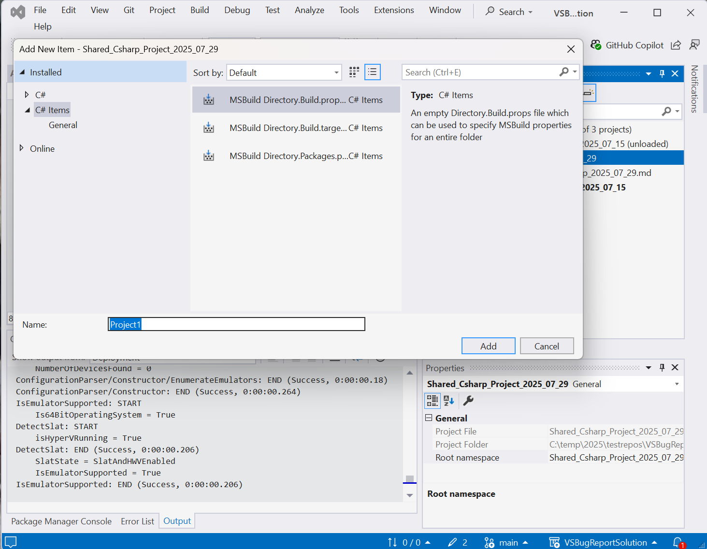

# "Add Class" doesn't work in Shared projects

## Repro

I created a **shared project** with the name "Shared_Csharp_Project_2025_07_29". It's critical that this is a shared project; other project types work as expected.

Then I selected and then right-clicked on the project in the Solution Explorer and selected **Add** > **Class ...**

The *Add New item* dialog pops up, then then there's a failure.

## Expected
In the *Add New Item* dialog on the left side, the "C#" item should be selected, and the on right "Class" should be selected. This lets me quickly add a new class.

## Actal results

In the *Add New Item** dialog on the left side, the "C# Items" is selected (not "C#"). Under is just a "General" subitem, and the on the right side there are three MS Build items. None of them are a "class". 

## Impact

My muscle memory for adding a new class is to simply select the "Add Class" context and then to hit "return" because "Class" is normally selected by default.

